# DEX_Depo - Power BI DAX Analysis Project

## Overview

DEX_Depo is a Power BI project focused on implementing Data Analysis Expressions (DAX), Data Modeling, Time Intelligence, Filter Context, Relationship Functions, and Matrix-based reporting.

The project demonstrates how DAX can be used to create business insights from sales and returns data through calculated columns, measures, and advanced analytical functions.

---

## Project Objectives

* Build a Star Schema data model
* Create calculated columns and measures
* Apply DAX aggregation and iterator functions
* Implement logical and text functions
* Perform Time Intelligence analysis
* Analyze Filter Context behavior
* Organize measures using a dedicated Measure Table
* Create business-oriented Matrix reports

---

## Data Model

### Fact Tables

* Sales_Fact
* Returns_Fact

### Dimension Tables

* Customer_Dim
* Product_Dim
* Region_Dim
* Date_Dim

---

## DAX Concepts Implemented

### Calculated Columns

* Profit
* ReturnFlag
* Customer Full Name
* Sales Category
* Sales Status
* Priority Sale

### Aggregation Functions

* SUM()
* AVERAGE()
* MAX()

### Counting Functions

* DISTINCTCOUNT()
* COUNTX()

### Logical Functions

* IF()
* AND()
* OR()
* SWITCH()

### Text Functions

* CONCATENATE()
* UPPER()
* LEFT()

### Date Functions

* YEAR()
* MONTH()
* EOMONTH()

### Relationship Functions

* RELATED()

### Filter Context Functions

* CALCULATE()
* FILTER()
* ALL()

### Time Intelligence Functions

* TOTALYTD()
* SAMEPERIODLASTYEAR()
* DATESINPERIOD()
* DATESBETWEEN()

### Iterator Functions

* SUMX()
* AVERAGEX()
* COUNTX()

---

## Key Measures

* Total Sales
* Total Cost
* Total Profit
* Total Returns
* Total Transactions
* Return Rate %
* Average Sale per Transaction
* Previous Month Sales
* Month Difference
* Previous Year Sales
* YTD Sales
* Running Total
* Revenue × Quantity
* Transaction Count X

---

# Project Screenshots

## Star Schema Data Model

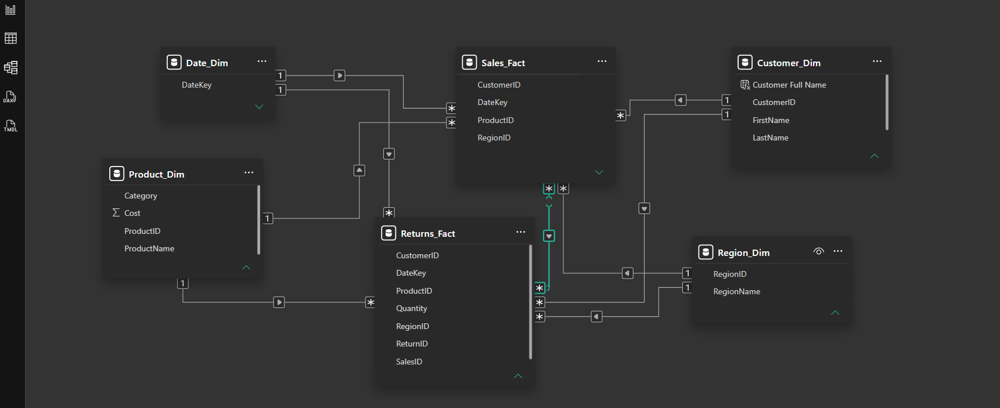

---

## Relationships View

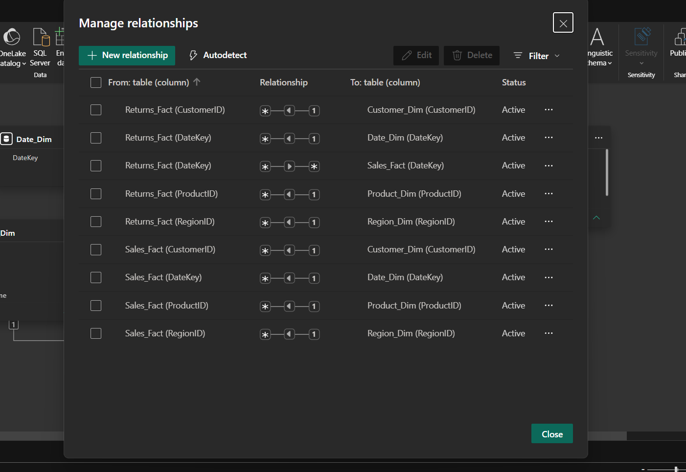

---

## Measure Table

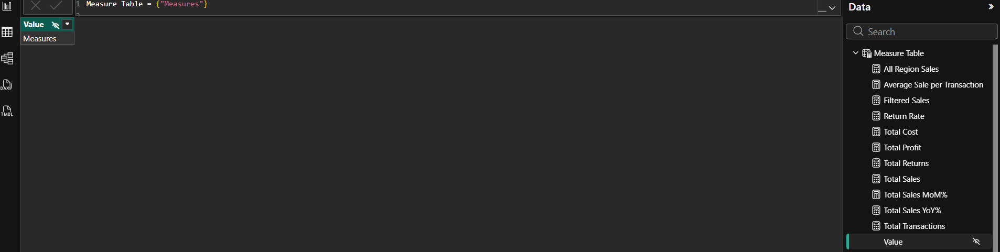

---

## Basic DAX Functions Matrix

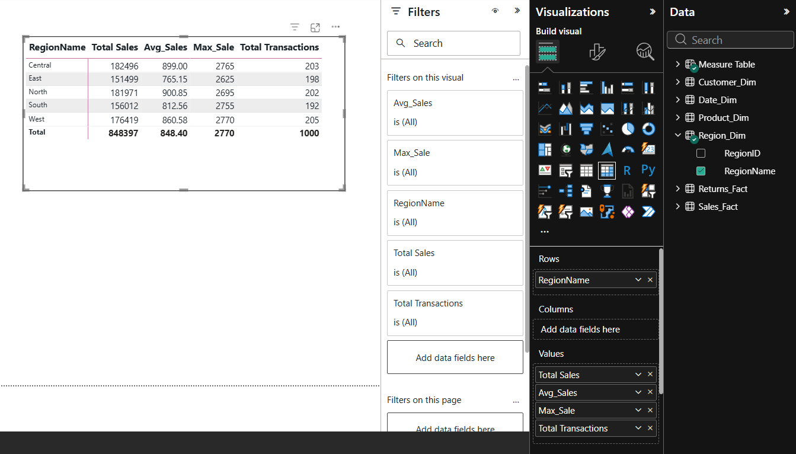

---

## Conditional Logic Functions

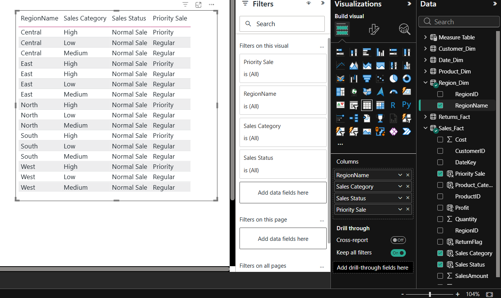

---

## Conditional Logic Output

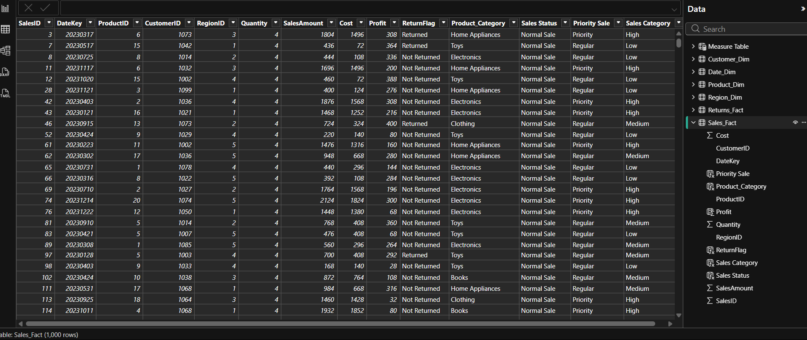

---

## Text Functions

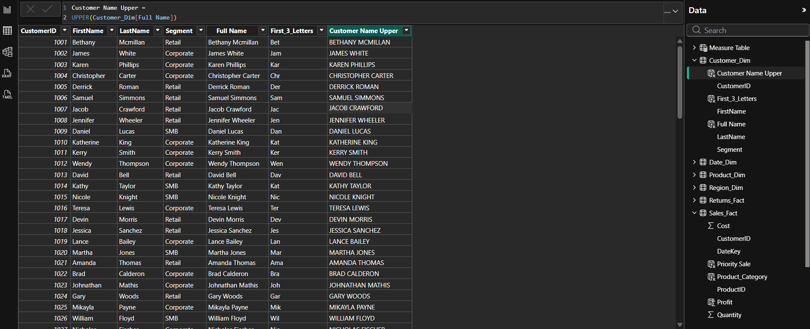

---

## Date Functions

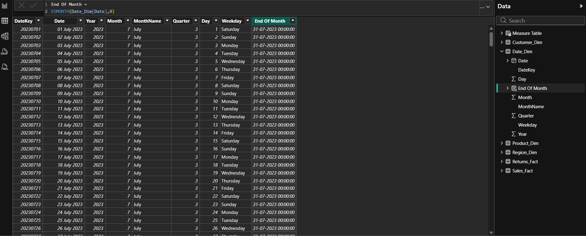

---

## RELATED Function

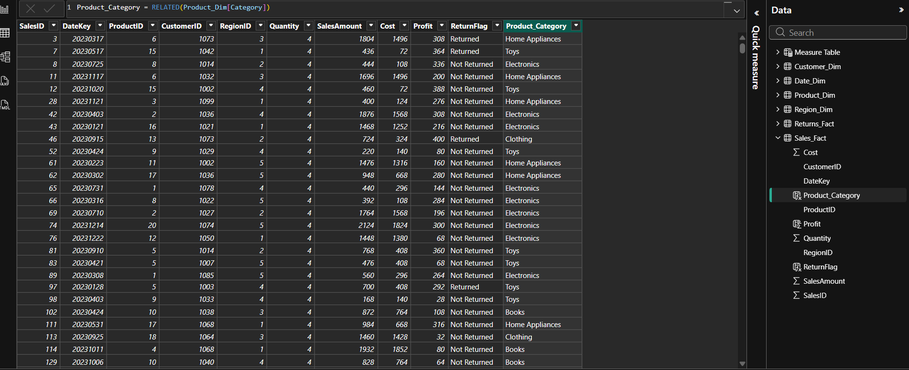

---

## Filter Context Analysis

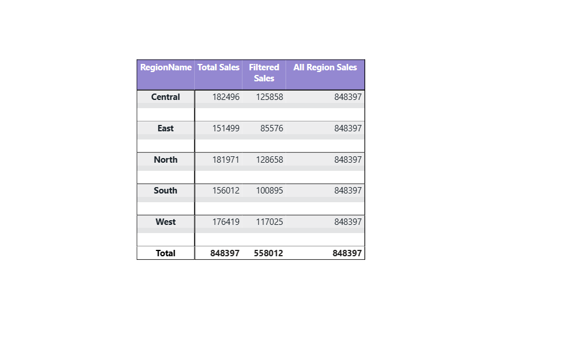

---

## Month-over-Month Quick Measure

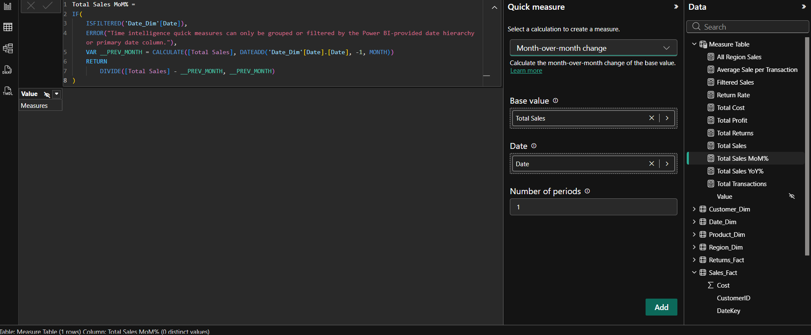

---

## Year-over-Year Quick Measure

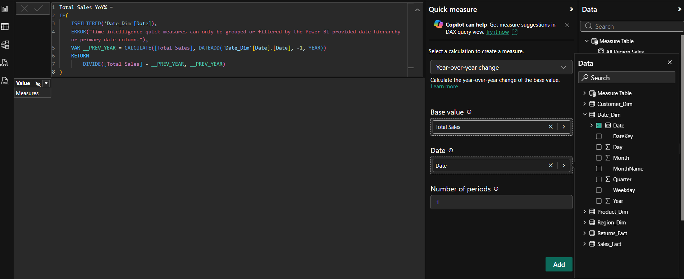

---

## Time Intelligence Table

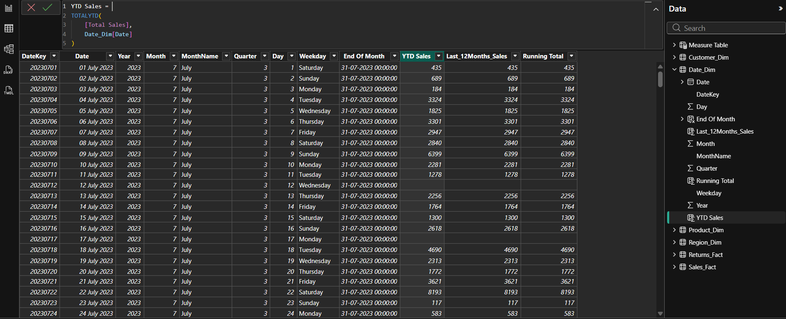

---

## Time Intelligence Matrix

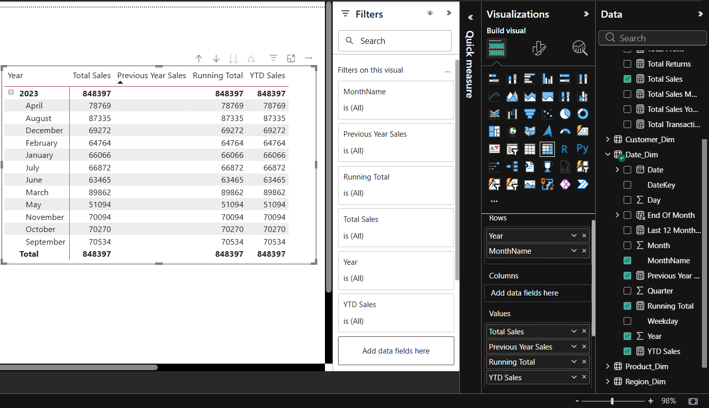

---

## Iterator Functions Matrix

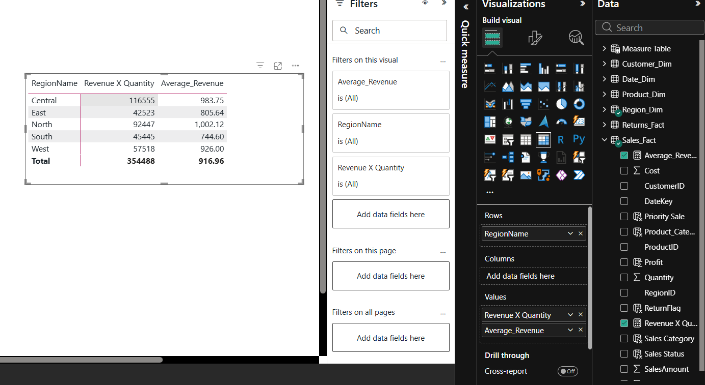

---

## Final DAX Analysis Matrix

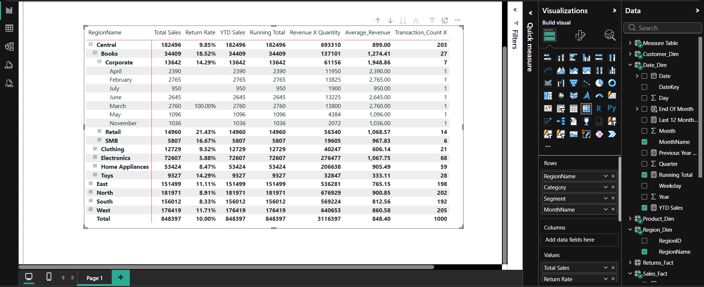

---

## DAX Formula Documentation

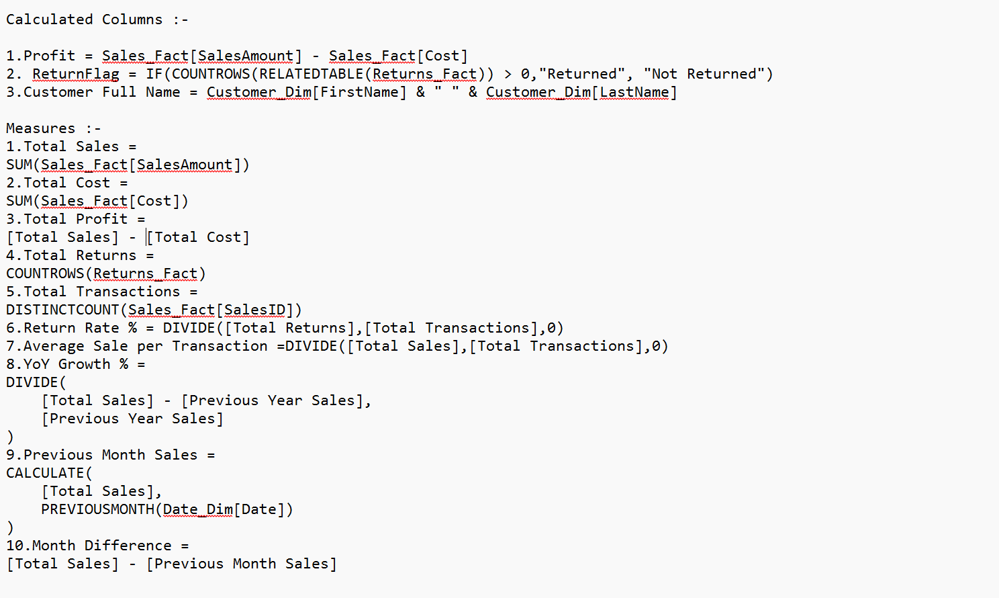

---

## Skills Demonstrated

* Power BI Data Modeling
* Star Schema Design
* DAX Development
* Calculated Columns
* Measures
* Filter Context Analysis
* Time Intelligence
* Iterator Functions
* Relationship Functions
* Matrix Reporting

---

## Tools Used

* Microsoft Power BI Desktop
* DAX (Data Analysis Expressions)
* Power Query
* Data Modeling

---

## Author

**Dixta**
Data Science Student | Power BI Developer

---
