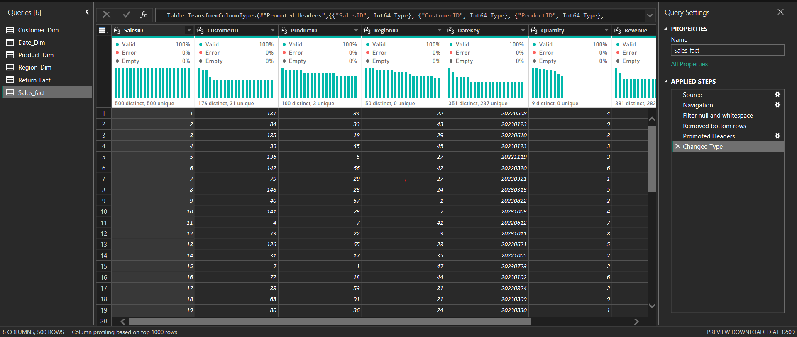
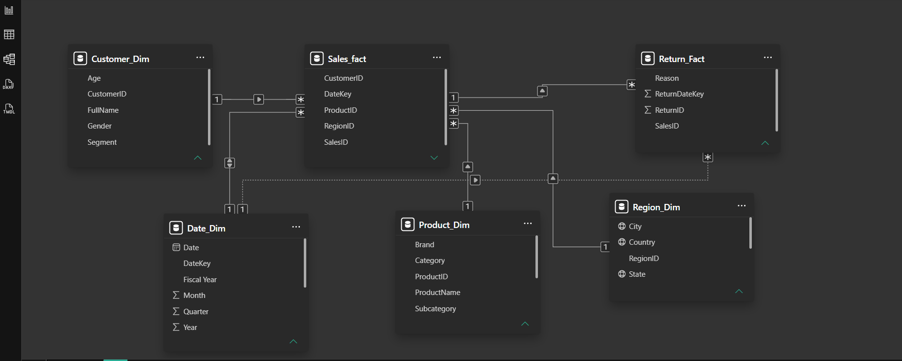
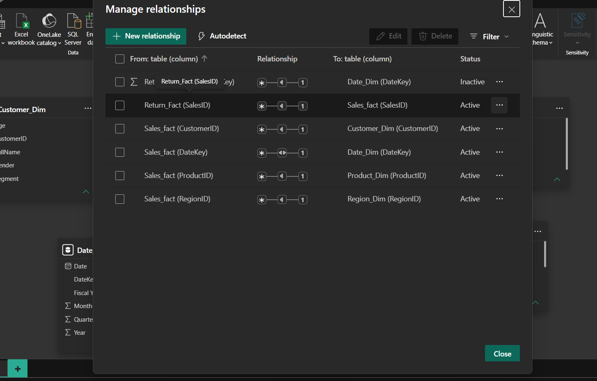
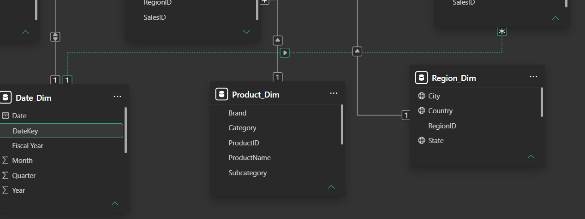
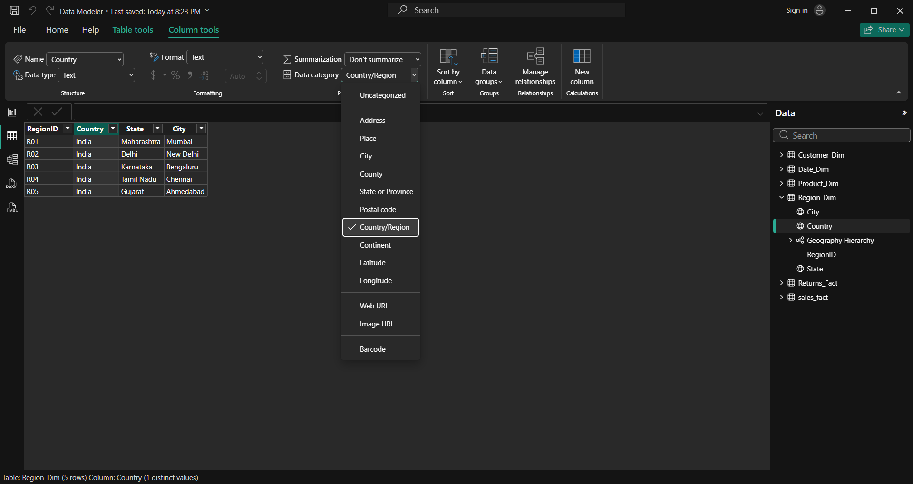
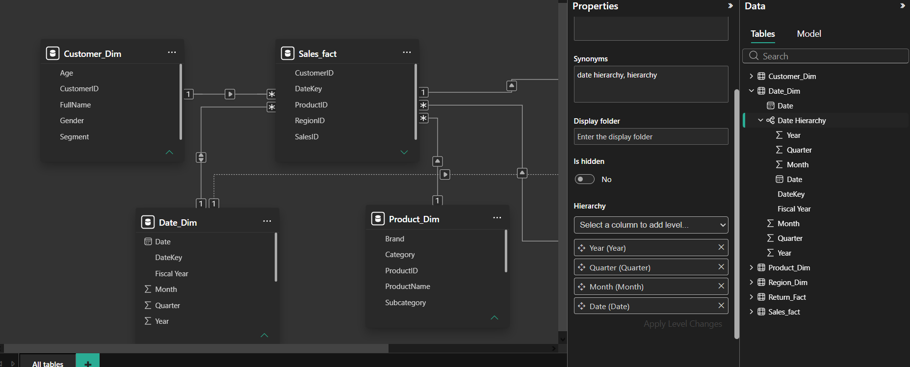
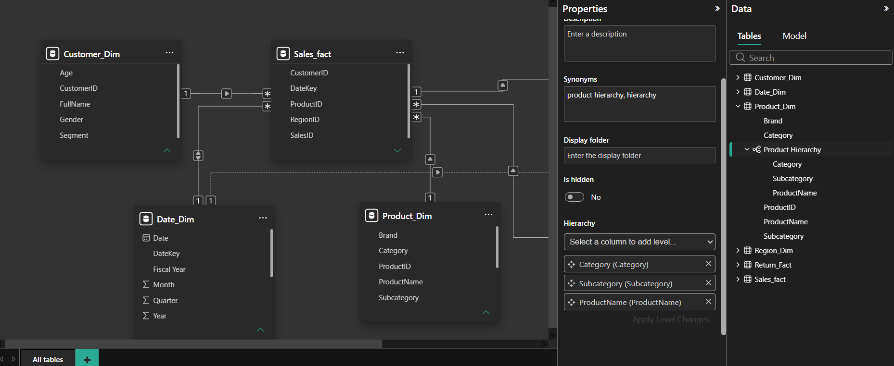
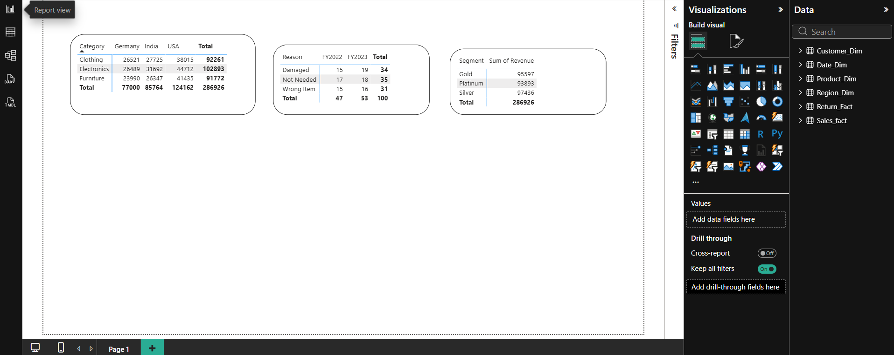

# Data Modeler - Building a Normalized Star Schema Data Model

## Project Overview

This project focuses on designing and implementing a normalized Star Schema data model in Power BI. The objective was to build a scalable and efficient model using Fact and Dimension tables, relationship management, hierarchies, data categories, and model validation techniques.

## Project Objectives

- Build a normalized Star Schema model
- Create and manage table relationships
- Configure relationship cardinality
- Implement hierarchies
- Apply data categories
- Demonstrate inactive relationships
- Handle ambiguity scenarios
- Validate model behavior using Matrix visuals

## Tools Used

- Power BI Desktop
- Power Query
- Model View

---

# Power Query Transformation

Prepared and structured the dataset using Power Query. Verified data types and organized Fact and Dimension tables.

---

# Star Schema Model

Designed a Star Schema model with Sales_Fact as the central fact table connected to Customer, Product, Date, and Region dimensions.

---

# Relationship Management

Configured table relationships, cardinality, and filter directions to ensure proper data flow throughout the model.

### Relationship Types Demonstrated

- One-to-Many (1:*)
- Many-to-One (*:1)
- One-to-One (1:1)

### Filter Direction

- Single Cross Filter Direction

---

# Inactive Relationship

Created an inactive relationship between Return_Fact and Date_Dim to demonstrate alternate filter paths and relationship management techniques.

---

# Data Categories

Configured geographic data categories for improved model usability.

### Categories Applied

- Country → Country/Region
- State → State/Province
- City → City

---

# Date Hierarchy

Created a Date Hierarchy:

- Year
- Quarte
- Month
- Date

---

# Region Hierarchy

Created a Region Hierarchy:

- Country
- State
- City

---

# Product Hierarchy

Created a Product Hierarchy:

- Category
- Subcategory
- Product Name

# Model Verification

Validated relationship flow and model behavior using Matrix visuals.

### Verification Scenarios

#### Sales by Product Category and Region

Verified dimension-to-fact filter propagation.

#### Return Reasons by Fiscal Year

Validated date-based relationship behavior.

#### Revenue by Customer Segment

Confirmed customer dimension integration with the sales fact table.

---

# Key Concepts Demonstrated

- Star Schema Design
- Fact and Dimension Tables
- Relationship Management
- Cardinality
- Cross Filter Direction
- Active and Inactive Relationships
- Hierarchies
- Data Categories
- Matrix Validation
- Filter Propagation

---

# Learning Outcomes

Through this project, I gained practical experience in:

- Designing scalable Power BI data models
- Creating and managing relationships
- Understanding Fact vs Dimension tables
- Implementing Star Schema architecture
- Handling inactive relationships
- Resolving ambiguity scenarios
- Building reusable hierarchies
- Applying data categories
- Validating model performance and accuracy

---

# Project Files

- Data_Modeler.pbix
- README.md
- Project Screenshots
