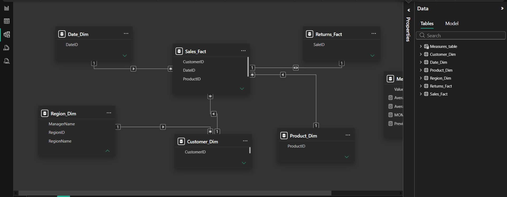
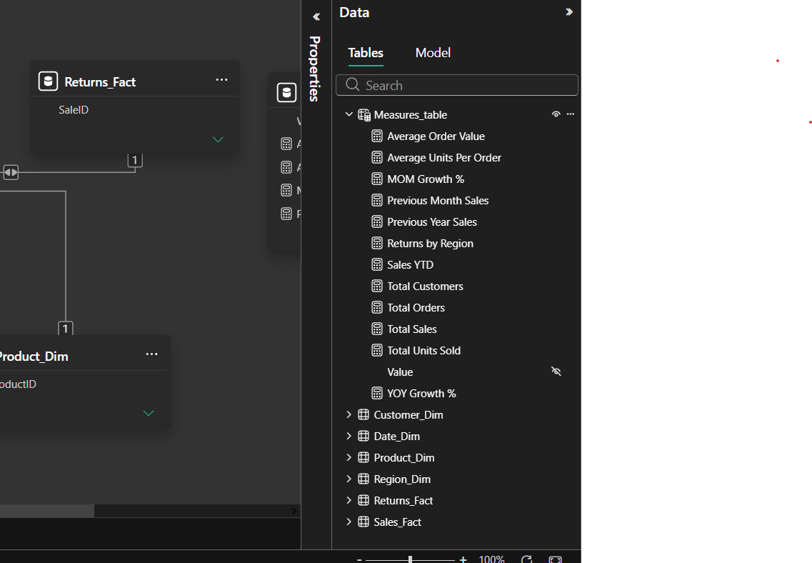
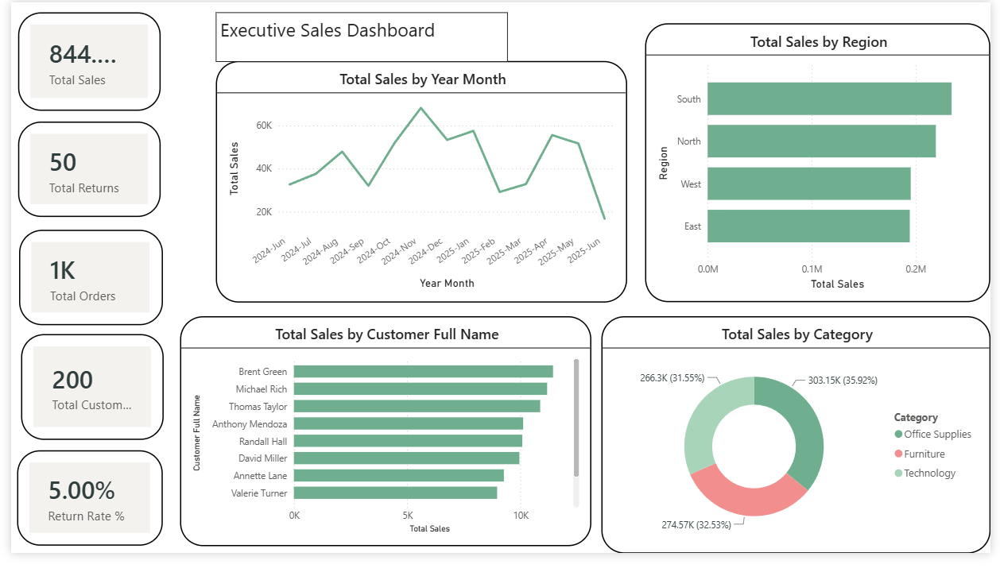
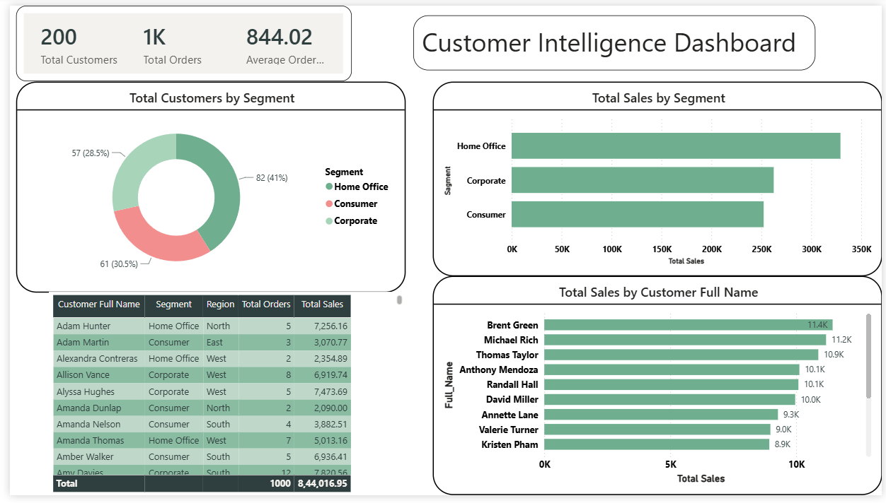
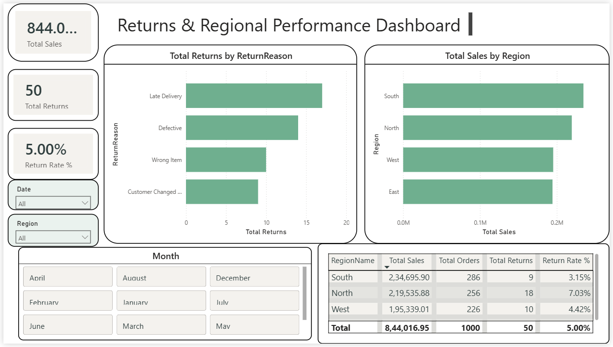
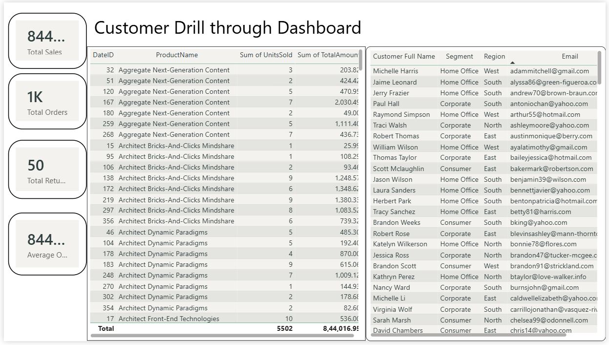

# 📊 Sales & Customer Intelligence Dashboard

## Overview

The Sales & Customer Intelligence Dashboard is an end-to-end Power BI analytics solution designed to provide actionable insights into sales performance, customer behavior, product trends, returns, and regional operations. The project leverages data modeling best practices, advanced DAX calculations, interactive reporting techniques, and security implementation to support data-driven decision-making.

This dashboard enables business stakeholders to monitor key performance indicators (KPIs), analyze customer segments, evaluate regional performance, track returns, and explore customer-level details through drillthrough functionality.

---

## Business Objectives

- Analyze sales performance across multiple dimensions.
- Monitor customer behavior and segmentation trends.
- Evaluate regional performance and return patterns.
- Implement interactive reporting for business users.
- Apply time intelligence calculations for trend analysis.
- Demonstrate secure data access using Row-Level Security (RLS).

---

## Dataset Structure

### Dimension Tables
- Date_Dim
- Customer_Dim
- Product_Dim
- Region_Dim

### Fact Tables
- Sales_Fact
- Returns_Fact

---

## Data Modeling

A Star Schema model was implemented to improve performance, scalability, and reporting efficiency.

### Key Features

- One-to-Many Relationships
- Dimension-to-Fact Modeling
- Hidden Technical Keys
- Consistent Naming Conventions
- Optimized Report Performance

### Data Model Screenshot



---

## Calculated Columns

### Customer Full Name

```DAX
Customer Full Name =
Customer_Dim[FirstName] & " " & Customer_Dim[LastName]
```

### Year Month

```DAX
Year Month =
FORMAT(Date_Dim[Date], "YYYY-MMM")
```

### YearMonthSort

```DAX
YearMonthSort =
YEAR(Date_Dim[Date]) * 100 + MONTH(Date_Dim[Date])
```

---

## DAX Measures

### Core Business KPIs

```DAX
Total Sales
Total Orders
Total Units Sold
Total Customers
Total Returns
Return Rate %
Average Order Value
Average Units Per Order
```

### Time Intelligence Measures

```DAX
Sales YTD
Previous Month Sales
MOM Growth %
Previous Year Sales
YOY Growth %
```

### DAX Measures Screenshot



---

# Dashboard Pages

## 1. Executive Sales Dashboard

### Purpose
Provides a high-level overview of business performance.

### Key Visuals

- Total Sales KPI
- Total Orders KPI
- Total Returns KPI
- Return Rate KPI
- Sales Trend Analysis
- Sales by Region
- Sales by Product Category
- Top Customers Analysis

### Screenshot



---

## 2. Customer Intelligence Dashboard

### Purpose
Analyzes customer behavior and segmentation.

### Key Visuals

- Total Customers KPI
- Customer Segmentation Analysis
- Sales by Segment
- Top Customers by Sales
- Customer Performance Table

### Screenshot



---

## 3. Returns & Regional Performance Dashboard

### Purpose
Monitors returns and evaluates regional business performance.

### Key Visuals

- Total Returns KPI
- Return Rate KPI
- Returns by Reason
- Sales by Region
- Regional Performance Table
- Conditional Formatting

### Screenshot



---

## 4. Customer Drillthrough Dashboard

### Purpose
Provides detailed customer-level analysis through drillthrough functionality.

### Key Visuals

- Customer Sales KPIs
- Purchase History
- Customer Information
- Interactive Drillthrough Navigation

### Screenshot



---

## Advanced Features

### Time Intelligence

Implemented advanced DAX calculations including:

- Year-to-Date (YTD)
- Month-over-Month Growth (MOM)
- Year-over-Year Growth (YOY)

### Drillthrough Navigation

Enabled detailed customer analysis through interactive drillthrough pages.

### Conditional Formatting

Applied visual enhancements to improve insight discovery and readability.

### Mobile Layout

Created mobile-optimized dashboard layouts for improved accessibility.

### Row-Level Security (RLS)

Implemented regional security roles allowing managers to view data only for their assigned region.

### RLS Screenshot


---

## Tools & Technologies

- Power BI Desktop
- Power Query
- DAX
- Data Modeling
- Row-Level Security (RLS)
- Interactive Dashboard Design

---

## Key Skills Demonstrated

- Data Modeling
- Star Schema Design
- DAX Development
- Time Intelligence
- KPI Development
- Business Intelligence Reporting
- Dashboard Design
- Drillthrough Navigation
- Conditional Formatting
- Row-Level Security
- Mobile Reporting

---

## Project Deliverables

- Power BI Report (.pbix)
- Interactive Multi-Page Dashboard
- Mobile Layout
- Row-Level Security Implementation
- DAX Measure Documentation
- Project Documentation

---

