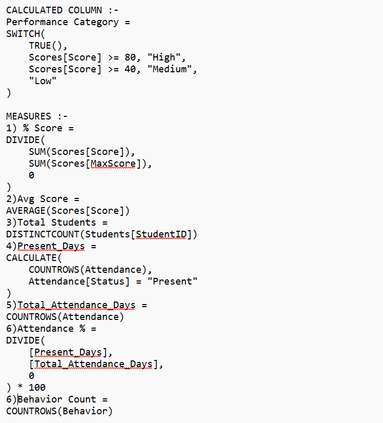
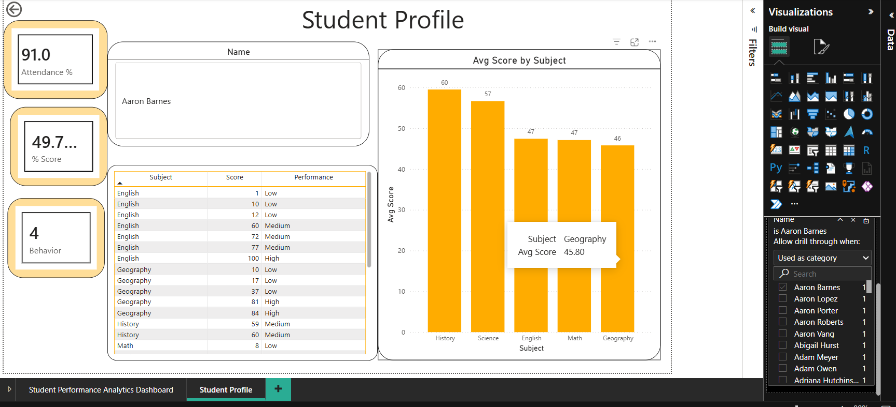

# Student Performance Dashboard

##  Overview

The Student Performance Dashboard is an interactive Power BI project designed to analyze academic performance, attendance records, and behavioral patterns of students.

The dashboard helps educators and stakeholders monitor student progress, identify trends, and gain insights through interactive visualizations and drill-through analysis.

---

## Tools Used

- Power BI Desktop
- Power Query
- DAX
- Data Modeling
- CSV Files

---

##  Dataset

The project uses four datasets:

- Students.csv
- Scores.csv
- Attendance.csv
- Behavior.csv

---

##  Dashboard Features

### KPI Cards

- Total Students
- Average Attendance %
- Average Score
- Behavior Count

### Visualizations

- Average Score by Subject
- Performance Trend by Term
- Behavior Distribution
- Student Performance Table
- Interactive Slicers

### Drillthrough Page

- Individual Student Profile
- Attendance %
- Score %
- Behavior Count
- Subject-wise Performance Details

---

# DAX Measures & Calculated Columns

### DAX Formulas Screenshot



---

## 📈 Dashboard Preview


---

## 👤 Student Profile Drillthrough



---

## 🔄 Power Query Data Cleaning


---

## 🗂 Data Model


---

## 📋 DAX Used

### Calculated Column

```DAX
Performance Category =
SWITCH(
    TRUE(),
    Scores[Score] >= 80, "High",
    Scores[Score] >= 40, "Medium",
    "Low"
)
```

### Measures

```DAX
% Score =
DIVIDE(
    SUM(Scores[Score]),
    SUM(Scores[MaxScore]),
    0
)

Avg Score =
AVERAGE(Scores[Score])

Total Students =
DISTINCTCOUNT(Students[StudentID])

Present_Days =
CALCULATE(
    COUNTROWS(Attendance),
    Attendance[Status] = "Present"
)

Total_Attendance_Days =
COUNTROWS(Attendance)

Attendance % =
DIVIDE(
    [Present_Days],
    [Total_Attendance_Days],
    0
) * 100

Behavior Count =
COUNTROWS(Behavior)
```

---

## 🚀 Skills Demonstrated

- Data Cleaning
- Data Transformation
- Data Modeling
- DAX
- Dashboard Design
- Drillthrough Functionality
- Data Visualization
- Business Intelligence Reporting

---

## 📁 Repository Structure

```text
Student-Performance-Dashboard/
│
├── README.md
├── Student Performance Dashboard.pbix
│
├── Dataset/
│   ├── Students.csv
│   ├── Scores.csv
│   ├── Attendance.csv
│   └── Behavior.csv
│
└── Screenshots/
    ├── Dashboard.png
    ├── Student_Profile.png
    ├── Power_Query.png
    ├── Data_Model.png
    └── DAX_Formulas.png
```

---


**Dixita Chuhane**

Aspiring Data Analyst | Power BI | SQL | Python
